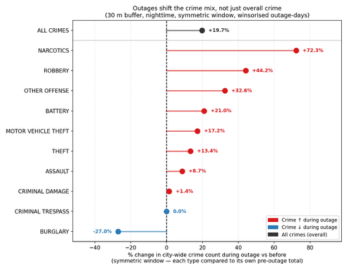
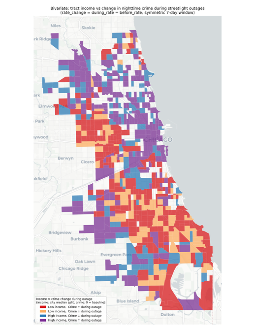

**Lecture Section:** Tuesday 11:00–12:20  

**GitHub Usernames:**  
HariDks, nandinikrishnan1

## **Research Question and Motivation**

Urban infrastructure failures may influence patterns of public safety and one such infrastructure component is street lighting. When streetlight outages occur, the resulting darkness reduces visibility and creates opportunities for offenders.

This project studies whether the **presence and duration of streetlight outages affect nearby crime patterns in Chicago**.

We examine three aspects of this relationship:

1. Whether crime rates change in areas near streetlight outages  
2. Whether longer outages are associated with greater crime exposure  
3. Whether outage-related crime changes vary across neighborhoods with different income levels  

Understanding these relationships, we develop a **dashboard and policy tool** that may help policymakers allocate infrastructure maintenance and law enforcement resources more effectively.

---

## **Data Sources**

To study the relationship between streetlight outages and crime, we combined three main datasets.

The first dataset is the **City of Chicago crime dataset (2011–2018)** containing incident-level geocoded records of crimes reported in the city and categorized by type.

The second dataset is **Chicago 311 streetlight service request data** from the same period. These records contain the location of the outage and the time the complaint was filed. From this information we calculated the **duration of each outage**.

The third dataset is the **Illinois census tract shapefile**, which provides tract boundaries along with **ACS demographic data**. This dataset allows us to examine whether the effects of streetlight outages on crime vary across neighborhoods.

By combining these datasets, we were able to study both the **spatial and temporal relationship** between streetlight outages and nearby crime incidents.

---

## **Approach and Coding**

The analysis was carried out using **Python**, and the packages used are listed in the `requirements.txt` file.

First, all spatial datasets were projected into the **EPSG:3435 coordinate system**, allowing distances to be measured accurately in meters. We then created **30 meter spatial buffers** around each streetlight outage location. Crimes that occurred within this buffer distance during nighttime hours were considered relevant to the outage.

Next, we constructed an **event-time variable** that measures the number of days between the crime date and the streetlight complaint date. Using this variable, we compared crimes that occurred **before the outage** with crimes that occurred **during the outage**, using symmetric time windows.

Instead of analyzing raw crime counts, we calculated **crime rates per outage-day**. This allowed outages with different durations to be compared consistently. We then calculated **excess crime**, defined as the difference between crime rates during and before outages.

From this process we created three main datasets:

1. Changes in crime composition by offense type  
2. Tract-level crime rate changes combined with income data  
3. Outage duration categories to study how crime exposure changes as outages last longer  

---

## **Static Visualizations**

The first visualization focuses on **changes in crime composition during outages**. Using the same symmetric time window, we compared crimes before outages with those that occurred during outages for each crime category. Total crime increases during outage periods. However, crimes such as **narcotics and robbery show the largest increases**, while burglary decreases relative to its baseline.

The second visualization is a **bivariate map combining income levels and crime changes across census tracts**. This map shows that outage-related crime increases are **not concentrated in lower-income neighborhoods**.

---

## **Streamlit Dashboard**

In addition to the static visualizations, we developed an interactive **Streamlit dashboard** to explore the relationship between streetlight outages and crime in Chicago.

The dashboard contains several pages highlighting different aspects of the analysis.

The **Overview page** displays a map showing active streetlight outages and crimes on a selected day. Users can select a date and zoom into specific census tracts to view outage locations and crime incidents.

The **Crime Impact page** compares crime rates before and during streetlight outages using spatial buffers around each outage location. It also includes a scatter plot showing correlations between census tract characteristics and changes in crime rates.

The **Hotspot Analysis page** identifies census tracts where crime near outages is higher than expected based on historical patterns.

The **Law Enforcement Dashboard** further breaks this down by crime type to highlight areas experiencing unusually high crime during outages.

This dashboard provides an interactive way to explore how streetlight outages and crime patterns are related across the city.

---

## **Weaknesses and Difficulties**

While conducting the analysis, we encountered several challenges.

One challenge was integrating multiple datasets with different coordinate systems and formats. Ensuring that all datasets were properly aligned spatially required careful data cleaning and projection.

Another limitation is that the analysis relies on **reported crime data**, which may not fully capture all criminal activity. Changes in reporting behavior could influence the observed patterns.

Additionally, the spatial buffer approach assumes that crimes occurring within **30 meters of a streetlight outage** are influenced by the outage. In reality, crime patterns are influenced by many other factors.

Despite these limitations, the analysis provides useful insights into how infrastructure failures such as streetlight outages may relate to changes in local crime patterns.